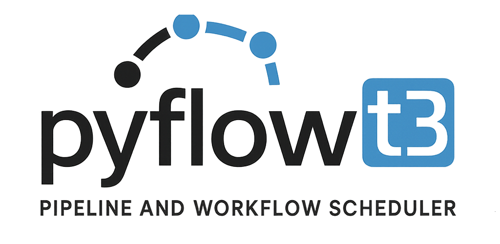

# 

**PyFlowT3** é um agendador de workflows desenvolvido em **Python** para execução, agendamento e monitoramento de **workflows e pipelines** do **Pentaho** e **Apache Hop**.

Com uma interface gráfica intuitiva, o PyFlowT3 facilita a automação de processos ETL, além de permitir a instalação como serviço no **Windows**. Agora também é possível executar workflows diretamente via **terminal**, ideal para integrações e scripts automatizados.

---

## 📄 Licença

Este projeto está licenciado sob a **Apache License 2.0**.  
Consulte o arquivo [LICENSE](LICENSE) para mais detalhes.

© 2025 Thiago Luis de Lima

---

## ⚙️ Instalação

### ✅ Pré-requisitos

- Python 3.8 ou superior instalado
- Python configurado nas variáveis de ambiente do sistema

### 📦 Instale as dependências

Execute no terminal na raiz do projeto como administrador:

```bash
 pip install -r requirements.txt
```
```bash
 ou execute o arquivo instalaDependencias.bat
```
  
## 📝 Renomeie o arquivo .env.example para .env

        # Configurações do banco de dados
        DB_PATH=agendador.db

        # Caminho para o executável hop-run do Apache Hop
        APACHE_HOP="C:\Apache-hop\hop-run.bat"

        # Caminho para os executáveis do Pentaho (Kitchen e Pan)
        PENTAHO_JOB="C:\data-integration\Kitchen.bat"
        PENTAHO_TRANSFORMATION="C:\data-integration\Pan.bat"    

        # Telegram
        # Crie um bot com  @BotFather, pegue o token e coloque em BOT_TOKEN.
        # Crie um grupo e adicione o bot ao grupo como administrador.
        # Depois mande algumas mensagens para o grupo, apos isso execute o extractChatIdTelegram.py
        # Ele vai encontar o id do grupo e inserir em CHAT_ID
        # Se preferir pegue o chat_id manualmente em https://api.telegram.org/bot<seutoken>/getUpdates
        BOT_TOKEN=123456:abcde
        CHAT_ID=-100987654321

        # E-mail
        EMAIL_FROM=seubot@gmail.com    # o e-mail que aparece como remetente
        EMAIL_USER=seubot@gmail.com    # o e-mail que autentica no SMTP
        EMAIL_PASS=sua_senha_aqui      # a senha do e-mail de login (pode ser senha de app)
        EMAIL_TO=voce@empresa.com
        SMTP_SERVER=smtp.gmail.com
        SMTP_PORT=587

        # Controle de notificações
        # NOTIFY_CHANNELS define os canais padrão de envio de notificação.
        # Exemplo: NOTIFY_CHANNELS=telegram,email
        # Para desativar os canais padrão, deixe em branco: NOTIFY_CHANNELS=
        NOTIFY_CHANNELS=telegram,email

## 🧩 Instalação do Serviço do (Windows) 

        python ServicoAgendadorWindows.py install
- **Atenção**: caso seu python estiver instalado a nivel de usuário, apos instalar o serviço vá em **logon** coloque a conta do usuário onde esta instalado.

## Comandos adicionais:
    ## Iniciar serviço:
        python ServicoAgendadorWindows.py start
    ## Reiniciar serviço:
        python ServicoAgendadorWindows.py restart
    ## Atualizar serviço:
        python ServicoAgendadorWindows.py update
    ## Remover serviço: 
        python ServicoAgendadorWindows.py remove
    ## Parar serviço:
        python ServicoAgendadorWindows.py stop

## 🚀 Iniciar o Agendador
Você pode iniciar o agendador de duas formas:

* Executando o arquivo **iniciaAgendador.bat**
* Criando um atalho chamado **"Agendador Workflows PyFlowT3"** na área de trabalho apontando para esse .bat
(O ícone está na pasta do projeto)

Nesta tela você poderá:
 * Adicionar novos workflows ou pipelines
 * Adicionar agendamentos para scripts que rodam no terminal.
 * Editar agendas existentes
 * Forçar execuções manuais

## 📊 Monitoramento

Para monitorar as execuções:

* Execute o arquivo **IniciaMonitor.bat**
* Ou crie um atalho chamado **"Monitoramento PyFlowT3"** na área de trabalho

Na tela de monitoramento você verá:

* Agendas ativas, com duração e última execução
* Logs de execução por dia
* Pesquisa e atualização de logs
* Ativar para atualização automatica dos logs
* Forçar execuções manuais

## 🧩 Instalação do Serviço do bot telegram (Windows) 

        python ServicoBotTelegram.py install
- **Atenção**: caso seu python estiver instalado a nivel de usuário, apos instalar o serviço vá em **logon** coloque a conta do usuário onde esta instalado.

## 🤖 BOT Telegram
    /agendas                    # Lista agendas ativas
    /buscar <termo_pesquisado>  # filtra agenda pesquisada

- Serão listadas as agendas e você poderá forçar a execução pelo telegram.

## 📁 Logs

* Os logs são salvos na pasta **logs**, com um arquivo por dia
* Verifique as **permissões de escrita** nessa pasta para garantir o funcionamento adequado

## 💬 Suporte

Em caso de dúvidas ou problemas, entre em contato com o desenvolvedor ou abra uma issue no repositório.

## Instalação e configuração PyflowT3

[Assista no YouTube](https://www.youtube.com/watch?v=aAMSeCVJL9U)

## Configuração notificação por telegram PyflowT3

[Assista no YouTube](https://www.youtube.com/watch?v=NGwjYMoza20)


